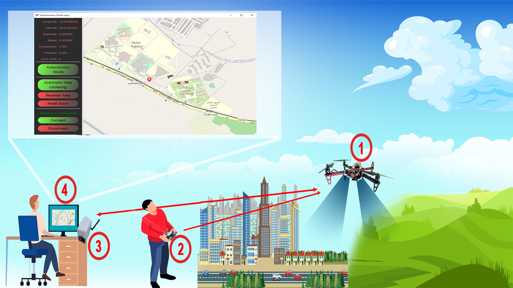
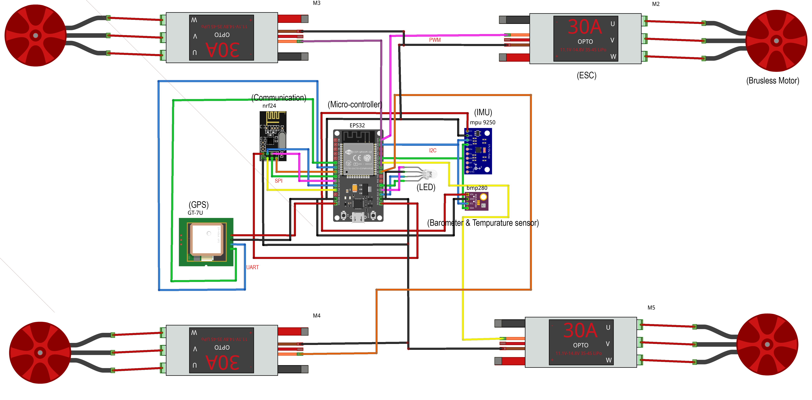
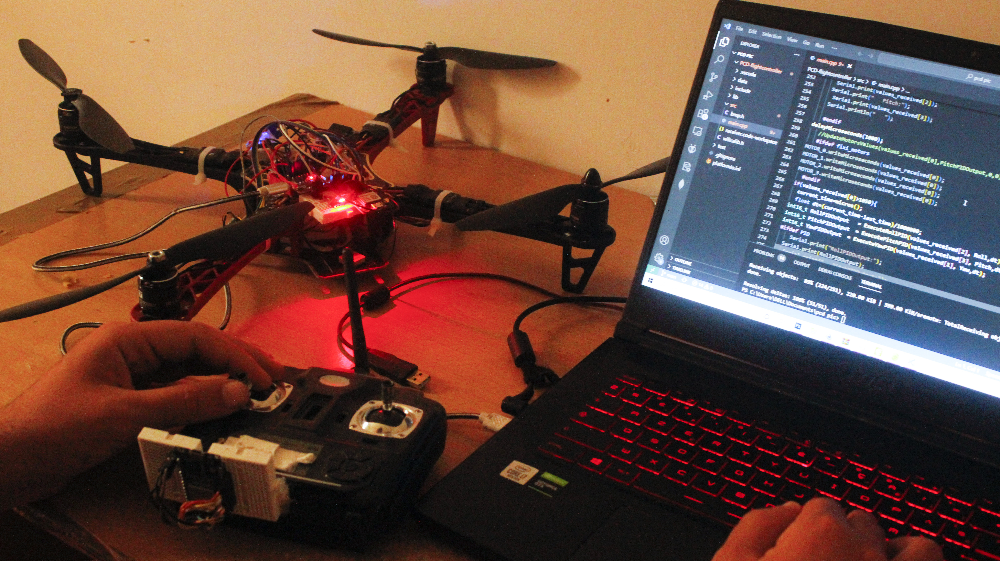
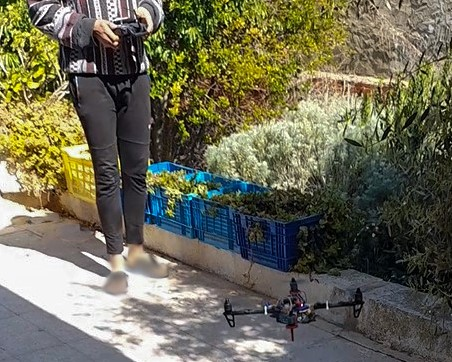

## Description
This project aimed to create a smart and versatile drone that can be controlled remotely using either a dedicated remote controller or a ground station. The drone is equipped with advanced sensors for motion processing, atmospheric pressure measurement, global positioning, and wireless communication, enabling it to collect and interact with valuable data. The team developed a sophisticated desktop application to monitor and analyze the gathered data, showcasing the drone's exceptional capabilities for various applications.
## Requirements 
Before running this project, make sure you have the following installed:
- git
- python 3.6+
- CPP compiler
- PlatformIO VS extension
# Clone the repo 
```
git clone https://github.com/hdfixi/PCD-flightcontroller.git
```
# Project overview

# Schematic

# System test

# Flight test 
